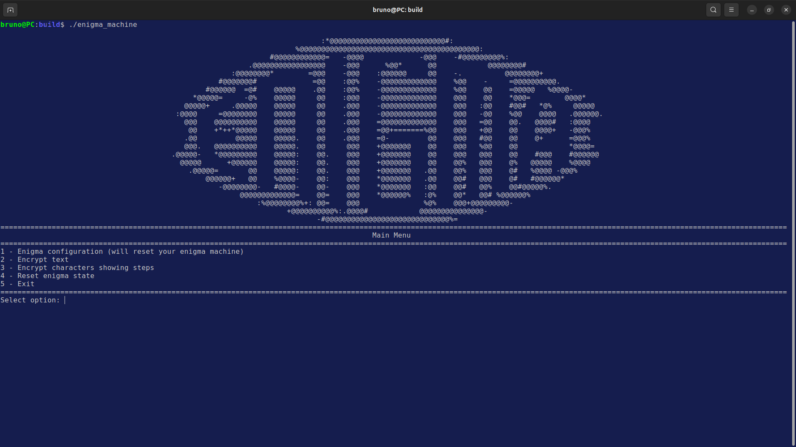
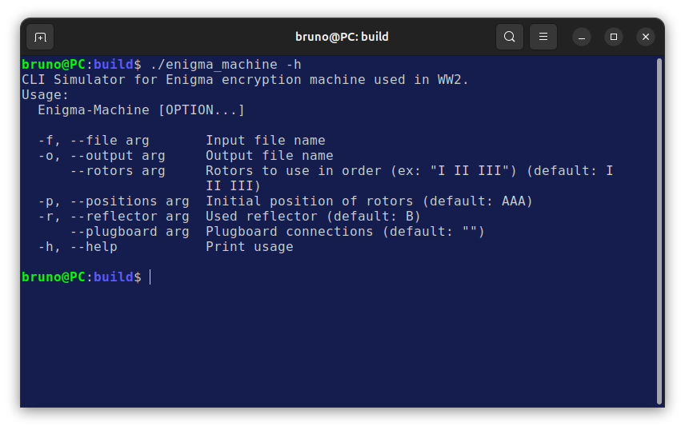
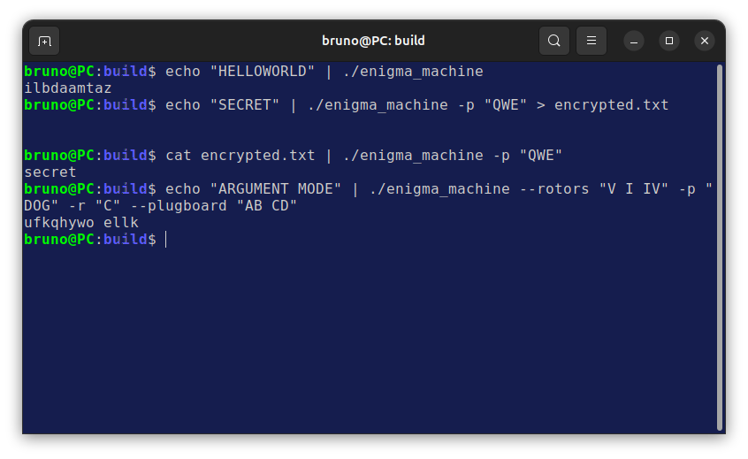

# Enigma Machine C++ Simulator

[Read this document in Portuguese (Leia este documento em Português)](./README.pt-br.md)

A command-line interface (CLI) simulator for the Enigma M3 encryption machine from World War 2, written in modern C++.

## ⏩ Features

- Complete Enigma M3 simulation with rotors (I-V), reflectors (A, B, C), and a configurable plugboard.

- **Dual-Mode Operation:** Functions as both an interactive menu and a command-line pipeline tool.

- **Full I/O Support:** Reads from `stdin` or files, writes to `stdout` or files, and works perfectly with pipes (`|`).

- **Full Configuration:** All machine settings are controllable via command-line flags (rotors, positions, reflector, and plugboard).

- **Robust Validation:** Protects against invalid machine configurations (e.g., incorrect rotor count, non-alphabetic positions).

- **Step-by-Step Mode:** A special feature in the interactive menu to visualize the character's path during encryption.

## 🔨 Building from Source

### Required

- `git` (for cloning and `FetchContent`)
- `cmake` (version 3.14 or higher)
- A C++17 compliant compiler (e.g., `g++`, `Clang`, `MSVC`)

### Instructions

``` bash
# 1. Cloning repository
git clone https://github.com/devbrunofernandes/enigma.git
cd enigma

# 2. Creating build directory
mkdir build && cd build

# 3. Cmake config
# This will automatically download cxxopts dependency.
cmake ..

# 4. Building
cmake --build .
```

## 🔌 Usage

This simulator can run in two distinct modes, depending on how it's launched.

### Interactive Mode

Starts an interactive menu that guides the user through setting up the Enigma machine and encrypting text.

**How to run:**

```bash
./enigma_machine
```

**Use Case:** Ideal for learning how the machine works, testing configurations, or using the step-by-step visualizer.



### Argument (Pipeline) Mode

Runs as a command-line filter, processing all input from `stdin` or a file and printing the result to `stdout` or a file.

**How to run:**

- Pass any command-line argument (like `-h` or `-f`).

- Pipe (`|`) input to it.

- Redirect (`>`) output from it.

**Use Case:** Designed for scripting and integrating with other command-line tools in a Unix-like pipeline. Also for processing text files.



## 🖥️ Command-Line Examples

